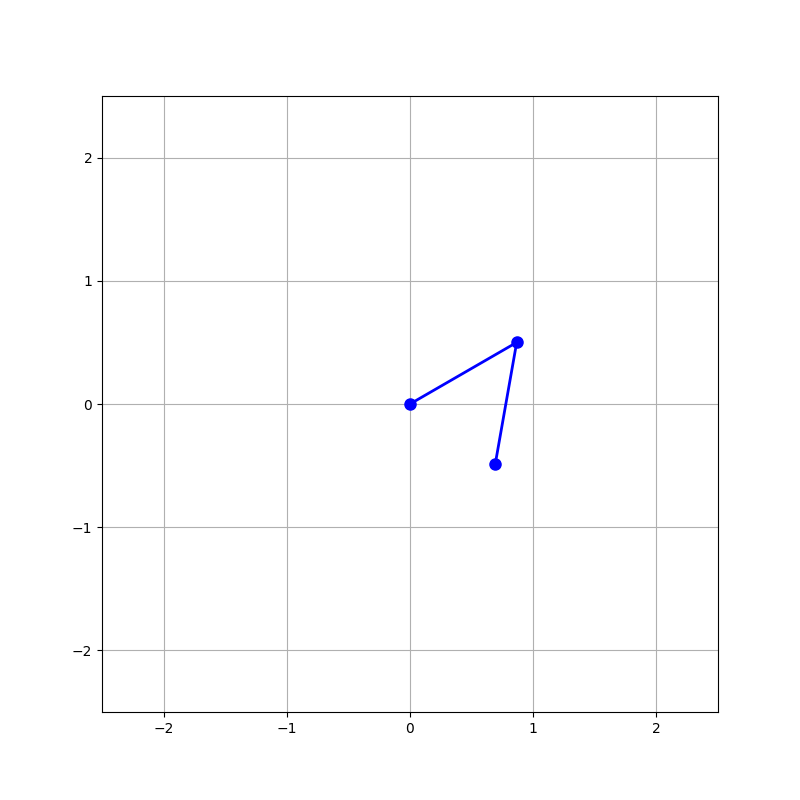
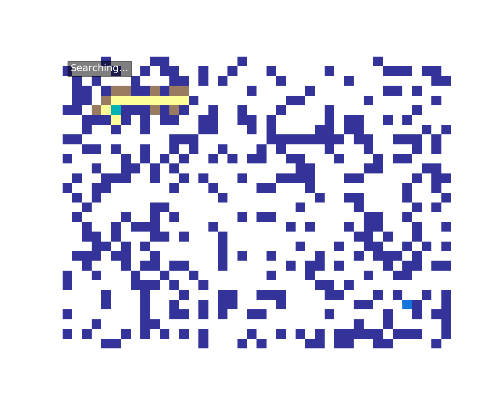
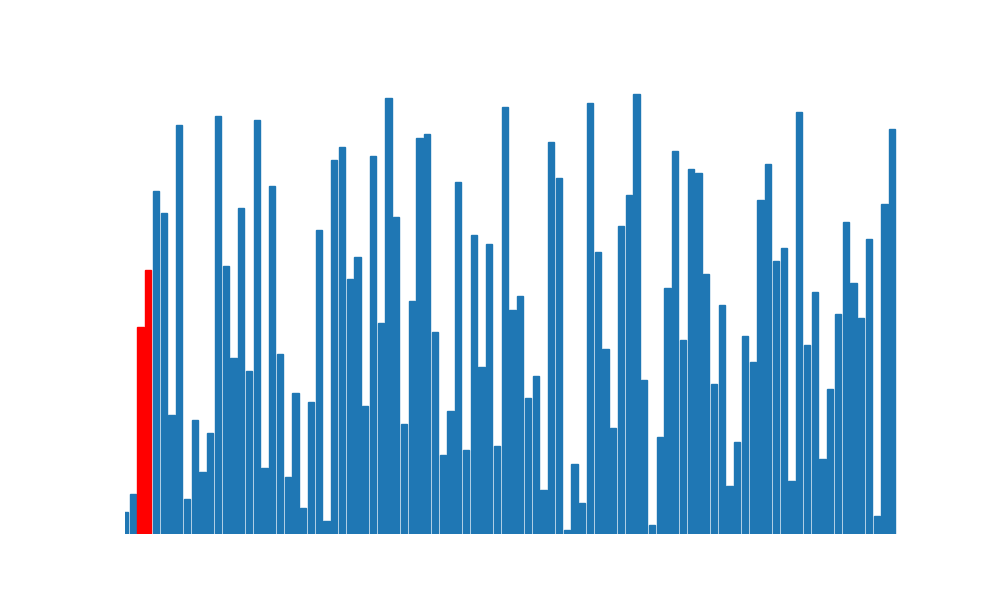

# ✨ Kinetica-Py-Viz: A Python Animation Collection

A curated collection of visually captivating scientific and mathematical phenomena, brought to life with Python and Matplotlib. This repository explores concepts from chaotic physics, cellular automata, pathfinding algorithms, and more.

---

A preview of some of the animations you can generate with this project.

<table>
  <tr>
    <td><br><sub>Double Pendulum</sub></td>
    <td><br><sub>Animated 3D Surface</sub></td>
    <td><br><sub>Conway's Game of Life</sub></td>
  </tr>
  <tr>
    <td><br><sub>A* Pathfinding</sub></td>
    <td><br><sub>Bubble Sort</sub></td>
    <td><br><sub>Barnsley Fern</sub></td>
  </tr>
</table>

---

## 🚀 Getting Started

Follow these instructions to get the project running on your local machine.

### Prerequisites

Make sure you have Python 3.7 or newer installed on your system.

### Clone the Repository

```
git clone https://github.com/YOUR_USERNAME/Kinetica.git
cd Kinetica
```

### Set Up a Virtual Environment

It's highly recommended to use a virtual environment to keep dependencies isolated.

**Create a virtual environment**

```
python3 -m venv venv
```

**Activate the environment**
On macOS and Linux:

```
source venv/bin/activate
```

On Windows:

```
.\venv\Scripts\activate
```

### Install Dependencies

The required libraries are listed in requirements.txt.
requirements.txt

```
numpy
matplotlib
scipy
noise
```

Install them using pip:

```
pip install -r requirements.txt
```

### Run an Animation

To see an animation, simply run any of the individual scripts. A window will pop up showing the live animation.

```
python3 double_pendulum.py
```

---

## 🔧 Project Structure

```Animation Scripts (.py)``` Each file (e.g., lorenz_attractor.py) is a self-contained script that generates a specific animation.

```animation_outputs``` You can see sample outputs here!

```README.md``` You are here!

---

## 🤝 Contributing

Contributions, issues, and feature requests are welcome! Feel free to check the issues page.

---

## 📄 License

This project is licensed under the MIT License - see the LICENSE.md file for details.
